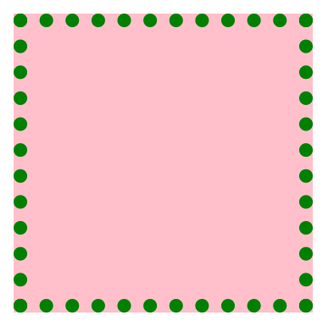
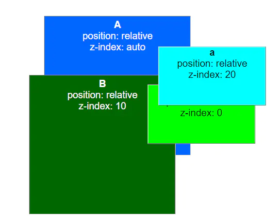
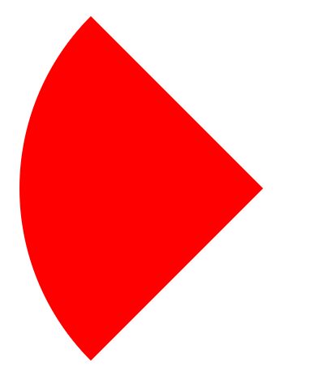

# CSS

- [CSS](#css)
  - [CSS3 新特性](#css3-新特性)
  - [CSS 盒模型](#css-盒模型)
  - [设置一个元素的背景颜色，背景颜色会填充哪些区域](#设置一个元素的背景颜色背景颜色会填充哪些区域)
  - [margin/padding 设置百分比是相对谁的](#marginpadding-设置百分比是相对谁的)
  - [link 和 @import 的区别](#link-和-import-的区别)
  - [CSS 选择器的解析规则](#css-选择器的解析规则)
  - [CSS 选择器优先级](#css-选择器优先级)
  - [::before 和:after 中双冒号和单冒号有什么区别？解释一下这 2 个伪元素的作用](#before-和after-中双冒号和单冒号有什么区别解释一下这-2-个伪元素的作用)
  - [伪类与伪元素的区别](#伪类与伪元素的区别)
  - [关于伪类 LVHA 的解释](#关于伪类-lvha-的解释)
  - [CSS 中哪些属性可以继承](#css-中哪些属性可以继承)
  - [CSS 清除浮动的方式](#css-清除浮动的方式)
  - [清除浮动的原理](#清除浮动的原理)
  - [BFC的概念, 哪些元素可以触发BFC](#bfc的概念-哪些元素可以触发bfc)
  - [脱离文档流的方式](#脱离文档流的方式)
  - [position 的值定位原点是](#position-的值定位原点是)
  - [display 有哪些值？说明他们的作用](#display-有哪些值说明他们的作用)
  - [float 的元素，display 是什么](#float-的元素display-是什么)
  - [inline-block、inline 和 block 的区别；为什么 img 是 inline 还可以设置宽高](#inline-blockinline-和-block-的区别为什么-img-是-inline-还可以设置宽高)
  - [flex 的属性有哪些](#flex-的属性有哪些)
  - [`visibility: hidden`, `opacity: 0`，`display: none`](#visibility-hidden-opacity-0display-none)
  - [了解重绘和重排吗，知道怎么去减少重绘和重排吗，让文档脱离文档流有哪些方法](#了解重绘和重排吗知道怎么去减少重绘和重排吗让文档脱离文档流有哪些方法)
  - [z-index 是干什么用的？默认值是什么？与 z-index: 0 的区别](#z-index-是干什么用的默认值是什么与-z-index-0-的区别)
  - [vw 和 vh 的概念](#vw-和-vh-的概念)
  - [经常遇到的浏览器的兼容性有哪些？原因，解决方法是什么，常用 hack 的技巧](#经常遇到的浏览器的兼容性有哪些原因解决方法是什么常用-hack-的技巧)
  - [简单介绍使用图片 base64 编码的优点和缺点](#简单介绍使用图片-base64-编码的优点和缺点)
  - [如果需要手动写动画，你认为最小时间间隔是多久，为什么](#如果需要手动写动画你认为最小时间间隔是多久为什么)
  - [阐述一下 CSSSprites](#阐述一下-csssprites)
  - [画一条 0.5px 的线](#画一条-05px-的线)
  - [transition 和 animation 的区别](#transition-和-animation-的区别)
  - [如何实现单行／多行文本溢出的省略（...）](#如何实现单行多行文本溢出的省略)
  - [常见的元素隐藏方式](#常见的元素隐藏方式)
  - [CSS3 @font-face 有用过吗](#css3-font-face-有用过吗)
  - [CSS 实现隔行变色](#css-实现隔行变色)
  - [一个满屏品字布局如何设计](#一个满屏品字布局如何设计)
  - [CSS 画三角形](#css-画三角形)
  - [CSS 画扇形](#css-画扇形)
  - [CSS 画正方体](#css-画正方体)
  - [CSS 实现一个硬币旋转的效果](#css-实现一个硬币旋转的效果)
  - [CSS 实现垂直居中](#css-实现垂直居中)
  - [CSS 实现两列固定，中间自适应的布局](#css-实现两列固定中间自适应的布局)
  - [实现自适应九宫格](#实现自适应九宫格)

## CSS3 新特性

[参考链接](https://www.cnblogs.com/xkweb/p/5862612.html)

1. 伪类和伪元素选择器：
   > :first-child, :last-child, :nth-child(1), :link, :visited, :hover, :active
   > ::before, ::after, :first-letter, :first-line, ::selection
2. 背景、边框和颜色透明度：
    > background-size, background-origin, border-radius
    > box-shadow, border-image
    > rgba
3. 文字效果：
    > text-shadow, word-wrap
4. 2D 转换和 3D 转换：
   > transform, translate(), rotate(), scale(), skew(), matrix()
   > rotateX(), rotateY(), perspective
5. 动画、过渡：animation, transition
6. 多列：column-count, column-gap, column-rule
7. 用户界面：resize, box-sizing, outline-offset

## CSS 盒模型

盒模型总共包括4个部分：

- content：内容，容纳着元素的”真实“内容，例如文本，图像或是视频播放器
- padding：内边距
- border：边框
- margin：外边距

两种盒模型的区别：

- W3C盒模型 `box-sizing: content-box`
  > W3C盒模型中，通过CSS样式设置的width的大小只是content的大小
- IE盒模型 `box-sizing: border-box`
  > IE盒模型中，通过CSS样式设置的width的大小是content + padding + border的和

## 设置一个元素的背景颜色，背景颜色会填充哪些区域

> border + padding + content

demo 说明

```css
div {
  width: 100px;
  height: 100px;
  background-color: pink;
  border: 5px dotted green;
}
```

效果图：


## margin/padding 设置百分比是相对谁的

先来看一个案例：

> 假设一个div，宽400px，高200px，他有个子div的margin:10%，你来算下他的margin 的 top, right, bottom, left 是多少？

```css
.outer {
    width: 400px;
    height: 200px;
    background-color: red;
    position: relative;
}
.inner {
    width: 100px;
    height: 100px;
    background-color: green;
    position: absolute;
    margin: 10%;
}

<div class="outer">
    <div class="inner"></div>
</div>
```

效果是子盒子的margin为40px 40px 40px 40px

总结：margin/padding设置百分比都是相对于父盒子的宽度(width属性)

## link 和 @import 的区别

1. link 是 HTML 标签，不仅可以加载 CSS 文件，还可以定义 RSS、rel 连接属性等；@import 是 CSS 提供的语法，只有导入样式表的作用。
2. 加载页面时，link 标签引入的 CSS 被同时加载；@import 引入的 CSS 将在页面加载完毕后被加载。
3. @import 是 CSS2.1 才有的语法，故只可在 IE5+ 才能识别；link 标签作为 HTML 元素，不存在兼容性问题。
4. 可以通过 JS 操作 DOM ，插入 link 标签来改变样式；由于 DOM 方法是基于文档的，无法使用@import 的方式插入样式。
5. link 引入的样式权重大于@import 引入的样式。

## CSS 选择器的解析规则

从右向左，这样会提高查找选择器所对应的元素的效率

## CSS 选择器优先级

选择器按优先级先后排列：!important>内联>id>class = 属性 = 伪类 >标签 = 伪元素 > 通配符 \*

- important 声明 1,0,0,0
- ID 选择器 0,1,0,0
- 类选择器 0,0,1,0
- 伪类选择器 0,0,1,0
- 属性选择器 0,0,1,0
- 标签选择器 0,0,0,1
- 伪元素选择器 0,0,0,1
- 通配符选择器 0,0,0,0

## ::before 和:after 中双冒号和单冒号有什么区别？解释一下这 2 个伪元素的作用

```css
在css3中使用单冒号来表示伪类，用双冒号来表示伪元素。但是为了兼容已有的伪元素的写法，在一些浏览器中也可以使用单冒号
来表示伪元素。

伪类一般匹配的是元素的一些特殊状态，如hover、link等，而伪元素一般匹配的特殊的位置，比如after、before等。
```

## 伪类与伪元素的区别

```js
css引入伪类和伪元素概念是为了格式化文档树以外的信息。也就是说，伪类和伪元素是用来修饰不在文档树中的部分，比如，一句
话中的第一个字母，或者是列表中的第一个元素。

伪类用于当已有的元素处于某个状态时，为其添加对应的样式，这个状态是根据用户行为而动态变化的。比如说，当用户悬停在指定的
元素时，我们可以通过:hover来描述这个元素的状态。

伪元素用于创建一些不在文档树中的元素，并为其添加样式。它们允许我们为元素的某些部分设置样式。比如说，我们可以通过::be
fore来在一个元素前增加一些文本，并为这些文本添加样式。虽然用户可以看到这些文本，但是这些文本实际上不在文档树中。

有时你会发现伪元素使用了两个冒号（::）而不是一个冒号（:）。这是CSS3的一部分，并尝试区分伪类和伪元素。大多数浏览
器都支持这两个值。按照规则应该使用（::）而不是（:），从而区分伪类和伪元素。但是，由于在旧版本的W3C规范并未对此进行
特别区分，因此目前绝大多数的浏览器都支持使用这两种方式表示伪元素。
```

## 关于伪类 LVHA 的解释

```js
a标签有四种状态：链接访问前、链接访问后、鼠标滑过、激活，分别对应四种伪类:link、:visited、:hover、:active；

当链接未访问过时：

（1）当鼠标滑过a链接时，满足:link和:hover两种状态，要改变a标签的颜色，就必须将:hover伪类在:link伪类后面声明；
（2）当鼠标点击激活a链接时，同时满足:link、:hover、:active三种状态，要显示a标签激活时的样式（:active），
必须将:active声明放到:link和:hover之后。因此得出LVHA这个顺序。

当链接访问过时，情况基本同上，只不过需要将:link换成:visited。

这个顺序能不能变？可以，但也只有:link和:visited可以交换位置，因为一个链接要么访问过要么没访问过，不可能同时满足，也就不存在覆盖的问题。
```

## CSS 中哪些属性可以继承

```css
每一个属性在定义中都给出了这个属性是否具有继承性，一个具有继承性的属性会在没有指定值的时候，会使用父元素的同属性的值
来作为自己的值。

一般具有继承性的属性有，字体相关的属性，font-size和font-weight等。文本相关的属性，color和text-align等。
表格的一些布局属性、列表属性如list-style等。还有光标属性cursor、元素可见性visibility。

当一个属性不是继承属性的时候，我们也可以通过将它的值设置为inherit来使它从父元素那获取同名的属性值来继承。
```

## CSS 清除浮动的方式

1. 额外标签法
   > 在需要清除浮动的元素后面添加一个空白标签，设置类名 clear，设置`clear: both;`即可
2. 父级元素添加`overflow: hidden;`
3. 父元素 `display：table`
4. 伪元素清除浮动
   > 对需要清除浮动的元素添加一个clearfix类名，设置样式如下：

    ```css
    .clearfix:after {
      /*正常浏览器 清除浮动*/
      content: '';
      display: block;
      height: 0;
      clear: both;
      visibility: hidden;
    }
    .clearfix {
      *zoom: 1;
      /*zoom 1 就是ie6 清除浮动方式  * ie7以下的版本才能识别 其他浏览器都不执行(略过)*/
    }
    ```

## 清除浮动的原理

- clear属性清除浮动：clear 属性规定元素盒子的边不能和浮动元素相邻。该属性只能影响使用清除的元素本身，不能影响其他元素。换而言之，如果已经存在浮动元素的话，那么该元素就不会像原本元素一样受其影响了。
- 其他的可以归为一类，都是通过触发BFC来实现的

## BFC的概念, 哪些元素可以触发BFC

> BFC 即 Block Formatting Context (块格式化上下文)， 是Web页面的可视化CSS渲染的一部分，是块盒子的布局过程发生的区域，也是浮动元素与其他元素交互的区域。

简单来说就是一个封闭的黑盒子，里面元素的布局不会影响外部。
下列方式会创建块格式化上下文：

- 根元素(\<html>)
- 浮动元素（元素的 float 不是 none）
- 绝对定位元素（元素的 position 为 absolute 或 fixed）
- 行内块元素（元素的 display 为 inline-block）
- 表格单元格（元素的 display为 table-cell，HTML表格单元格默认为该值）
- 表格标题（元素的 display 为 table-caption，HTML表格标题默认为该值）
- 匿名表格单元格元素（元素的 display为 table、table-row table-row-group、table-header-group、table-footer-group（分别是-  HTML table、row、tbody、thead、tfoot的默认属性）或 inline-table）
- overflow 值不为 visible 的块元素
- display 值为 flow-root 的元素
- contain 值为 layout、content或 paint 的元素
- 弹性元素（display为 flex 或 inline-flex元素的直接子元素）
- 网格元素（display为 grid 或 inline-grid 元素的直接子元素）
- 多列容器（元素的 column-count 或 column-width 不为 auto，包括 -  column-count 为 1）
- column-span 为 all 的元素始终会创建一个新的BFC，即使该元素没有包裹在一个多列容器中（标准变更，Chrome bug）。

## 脱离文档流的方式

- float
- position: absolute
- position: fixed

## position 的值定位原点是

```css
absolute
生成绝对定位的元素，相对于值不为static的第一个父元素的paddingbox进行定位，也可以理解为离自己这一级元素最近的
一级position设置为absolute或者relative的父元素的paddingbox的左上角为原点的。

fixed（老IE不支持）
生成绝对定位的元素，相对于浏览器窗口进行定位。

relative
生成相对定位的元素，相对于其元素本身所在正常位置进行定位。

static
默认值。没有定位，元素出现在正常的流中（忽略top,bottom,left,right,z-index声明）。

sticky
元素根据正常文档流进行定位，然后相对它的最近滚动祖先（nearest scrolling ancestor）和 containing block (最近块级祖先 nearest block-level ancestor)，
包括table-related元素，基于top, right, bottom, 和 left的值进行偏移。偏移值不会影响任何其他元素的位置。
该值总是创建一个新的层叠上下文（stacking context）。注意，一个sticky元素会“固定”在离它最近的一个拥有“滚动机制”的祖先上（当该祖先的overflow 是 hidden, scroll, auto, 或 overlay时），
即便这个祖先不是真的滚动祖先。这个阻止了所有“sticky”行为（详情见Github issue on W3C CSSWG）。
```

## display 有哪些值？说明他们的作用

- block
  块类型。默认宽度为父元素宽度，可设置宽高，换行显示。
- none
  元素不显示，并从文档流中移除。
- inline
  行内元素类型。默认宽度为内容宽度，不可设置宽高，同行显示。
- inline-block
  默认宽度为内容宽度，可以设置宽高，同行显示。
- list-item
  像块类型元素一样显示，并添加样式列表标记。
- table
  此元素会作为块级表格来显示。
- inherit
  规定应该从父元素继承display属性的值。

## float 的元素，display 是什么

```css
display 为 block
```

## inline-block、inline 和 block 的区别；为什么 img 是 inline 还可以设置宽高

```css
Block 是块级元素，其前后都会有换行符，能设置宽度，高度，margin/padding 水平垂直方向都有效。

Inline：设置 width 和 height 无效，margin 在竖直方向上无效，padding 在水平方向垂直方向都有效，前后无换行符

Inline-block：能设置宽度高度，margin/padding 水平垂直方向 都有效，前后无换行符
```

```css
img 是可替换元素。

在 CSS 中，可替换元素（replaced element）的展现效果不是由 CSS 来控制的。这些元素是一种外部对象，它们外观的渲染，是独立于 CSS 的。
简单来说，它们的内容不受当前文档的样式的影响。CSS 可以影响可替换元素的位置，但不会影响到可替换元素自身的内容。
例如 `<iframe>` 元素，可能具有自己的样式表，但它们不会继承父文档的样式。

典型的可替换元素有：
  <iframe>
  <video>
  <embed>
  

有些元素仅在特定情况下被作为可替换元素处理，例如：
  <input> "image" 类型的 <input> 元素就像  一样可替换
  <option>
  <audio>
  <canvas>
  <object>
  <applet>（已废弃）
  CSS 的 content 属性用于在元素的 ::before 和 ::after 伪元素中插入内容。使用 content 属性插入的内容都是匿名的可替换元素。
```

## flex 的属性有哪些

```JS
flex布局是CSS3新增的一种布局方式，我们可以通过将一个元素的display属性值设置为flex从而使它成为一个flex容器，它的所有子元素都会成为它的项目。

一个容器默认有两条轴，一个是水平的主轴，一个是与主轴垂直的交叉轴。我们可以使用flex-direction来指定主轴的方向。我们可以使用justify-content来指定元素在主轴上的排列方式，使用align-items来指定元素在交叉轴上的排列方式。还可以使用flex-wrap来规定当一行排列不下时的换行方式。

对于容器中的项目，我们可以使用order属性来指定项目的排列顺序，还可以使用flex-grow来指定当排列空间有剩余的时候，项目的放大比例。还可以使用flex-shrink来指定当排列空间不足时，项目的缩小比例。
```

> 以下 6 个属性设置在容器上。

- flex-direction 属性决定主轴的方向（即项目的排列方向）。
- flex-wrap 属性定义，如果一条轴线排不下，如何换行。
- flex-flow 属性是 flex-direction 属性和 flex-wrap 属性的简写形式，默认值为 rownowrap。
- justify-content 属性定义了项目在主轴上的对齐方式。
- align-items 属性定义项目在交叉轴上如何对齐。
- align-content 属性定义了多根轴线的对齐方式。如果项目只有一根轴线，该属性不起作用。

> 以下 6 个属性设置在项目上：

- order 属性定义项目的排列顺序。数值越小，排列越靠前，默认为 0。
- flex-grow 属性定义项目的放大比例，默认为 0，即如果存在剩余空间，也不放大。
- flex-shrink 属性定义了项目的缩小比例，默认为 1，即如果空间不足，该项目将缩小。
- flex-basis 属性定义了在分配多余空间之前，项目占据的主轴空间。浏览器根据这个属性，计算主轴是否有多余空间。它的默认值为 auto，即项目的本来大小。
- flex 属性是 flex-grow，flex-shrink 和 flex-basis 的简写，默认值为 01auto。
- align-self 属性允许单个项目有与其他项目不一样的对齐方式，可覆盖 align-items 属性。默认值为 auto，表示继承父元素的 align-items 属性，如果没有父元素，则等同于 stretch。

## `visibility: hidden`, `opacity: 0`，`display: none`

```css
opacity: 0，该元素隐藏起来了，但不会改变页面布局，并且，如果该元素已经绑定一些事件，如 click 事件，那么点击该区域，也能触发点击事件的；

visibility: hidden，该元素隐藏起来了，但不会改变页面布局，但是不会触发该元素已经绑定的事件；

display: none，把元素隐藏起来，并且会改变页面布局，可以理解成在页面中把该元素删除掉一样。
```

## 了解重绘和重排吗，知道怎么去减少重绘和重排吗，让文档脱离文档流有哪些方法

DOM 的变化影响到了预算内宿的几何属性比如宽高，浏览器重新计算元素的几何属性，其他元素的几何属性也会受到影响，浏览器需要重新构造渲染书，这个过程称之为重排，浏览器将受到影响的部分重新绘制在屏幕上 的过程称为重绘，引起重排重绘的原因有：

- 添加或者删除可见的 DOM 元素，
- 元素尺寸位置的改变
- 浏览器页面初始化，
- 浏览器窗口大小发生改变，重排一定导致重绘，重绘不一定导致重排，

减少重绘重排的方法有：

- 不在布局信息改变时做 DOM 查询，
- 使用 csstext,className 一次性改变属性
- 使用 fragment
- 对于多次重排的元素，比如说动画。使用绝对定位脱离文档流，使其不影响其他元素
- "editor.renderIndentGuides": true

## z-index 是干什么用的？默认值是什么？与 z-index: 0 的区别

参考链接：[搞懂Z-index的所有细节](https://www.jianshu.com/p/cdd90d28380b)
> z-index 属性设置元素的堆叠顺序，且只在属性position: relative/absolute/fixed 的时候才生效。
> `z-index: auto` 是默认值，与`z-index: 0`是有区别的：
> `z-index: 0` 会创建一个新的堆叠上下文，而 `z-index: auto` 不会创建新的堆叠上下文

举例：考虑如下这种情况

```html
<div class="A">
  <div class="a"></div>
</div>
<div class="B">
  <div class="b"></div>
</div>
```


> 上图中div的`z-index`均为整数的时候div(a)的`z-index`虽然比div(B)大，但是div(A)和div(a)是在一个堆叠上下文，而div(B)和div(b)是在一个堆叠上下文，这两个堆叠上下文是通过父级也就是div(A)和div(B)的`z-index`来决定层叠顺序的。

---

> 上图将div(A)的z-index设置为auto，这时候因为`z-index: auto` 不会创建新的堆叠上下文，因而div(a)的`z-index`比div(B)大，所以div(a)会在div(B)的上面

总结：

1. 当Z-index的值设置为auto时,不建立新的堆叠上下文,当前堆叠上下文中生成的div的堆叠级别与其父项的框相同。
2. 当Z-index的值设置为一个整数时,该整数是当前堆叠上下文中生成的div的堆栈级别。该框还建立了其堆栈级别的本地堆叠上下文。这意味着后代的z-index不与此元素之外的元素的z-index进行比较。

## vw 和 vh 的概念

vw（Viewport Width）、vh(Viewport Height)是基于视图窗口的单位，是css3的一部分，基于视图窗口的单位，除了vw、vh还有vmin、vmax。

- vw:1vw 等于视口宽度的1%
- vh:1vh 等于视口高度的1%
- vmin: 选取 vw 和 vh 中最小的那个,即在手机竖屏时，1vmin=1vw
- vmax:选取 vw 和 vh 中最大的那个 ,即在手机竖屏时，1vmax=1vh

## 经常遇到的浏览器的兼容性有哪些？原因，解决方法是什么，常用 hack 的技巧

```css
（1）png24位的图片在iE6浏览器上出现背景
解决方案：做成PNG8，也可以引用一段脚本处理。

（2）浏览器默认的margin和padding不同
解决方案：加一个全局的*{margin:0;padding:0;}来统一。

（3）IE6双边距bug：在IE6下，如果对元素设置了浮动，同时又设置了margin-left或
margin-right，margin值会加倍。

#box{float:left;width:10px;margin:00010px;}

这种情况之下IE会产生20px的距离
解决方案：在float的标签样式控制中加入_display:inline;将其转化为行内属性。(_这个符号只有ie6会识别)

（4）渐进识别的方式，从总体中逐渐排除局部。
首先，巧妙的使用"\9"这一标记，将IE游览器从所有情况中分离出来。
接着，再次使用"+"将IE8和IE7、IE6分离开来，这样IE8已经独立识别。
.bb{
background-color:#f1ee18;/*所有识别*/
.background-color:#00deff\9;/*IE6、7、8识别*/
+background-color:#a200ff;/*IE6、7识别*/
_background-color:#1e0bd1;/*IE6识别*/
}

（5）IE下，可以使用获取常规属性的方法来获取自定义属性，也可以使用getAttribute()获取自定义
属性；Firefox下，只能使用getAttribute()获取自定义属性
解决方法：统一通过getAttribute()获取自定义属性。

（6）IE下，event对象有x、y属性，但是没有pageX、pageY属性;Firefox下，event对象有
pageX、pageY属性，但是没有x、y属性。
解决方法：（条件注释）缺点是在IE浏览器下可能会增加额外的HTTP请求数。

（7）Chrome中文界面下默认会将小于12px的文本强制按照12px显示
解决方法：

  1.可通过加入CSS属性-webkit-text-size-adjust:none;解决。但是，在chrome
  更新到27版本之后就不可以用了。

  2.还可以使用-webkit-transform:scale(0.5);注意-webkit-transform:scale(0.75);
  收缩的是整个span的大小，这时候，必须要将span转换成块元素，可以使用display：block/inline-block/...；

（8）超链接访问过后hover样式就不出现了，被点击访问过的超链接样式不再具有hover和active了
解决方法：改变CSS属性的排列顺序L-V-H-A

（9）怪异模式问题：漏写DTD声明，Firefox仍然会按照标准模式来解析网页，但在IE中会触发怪异模
式。为避免怪异模式给我们带来不必要的麻烦，最好养成书写DTD声明的好习惯。
```

## 简单介绍使用图片 base64 编码的优点和缺点

```css
base64编码是一种图片处理格式，通过特定的算法将图片编码成一长串字符串，在页面上显示的时候，可以用该字符串来代替图片的
url属性。

使用base64的优点是：

（1）减少一个图片的HTTP请求

使用base64的缺点是：

（1）根据base64的编码原理，编码后的大小会比原文件大小大1/3，如果把大图片编码到html/css中，不仅会造成文件体
积的增加，影响文件的加载速度，还会增加浏览器对html或css文件解析渲染的时间。

（2）使用base64无法直接缓存，要缓存只能缓存包含base64的文件，比如HTML或者CSS，这相比域直接缓存图片的效果要
差很多。

（3）兼容性的问题，ie8以前的浏览器不支持。

一般一些网站的小图标可以使用base64图片来引入。
```

## 如果需要手动写动画，你认为最小时间间隔是多久，为什么

```css
多数显示器默认频率是60Hz，即1秒刷新60次，所以理论上最小间隔为1/60*1000ms＝16.7ms
```

## 阐述一下 CSSSprites

```css
将一个页面涉及到的所有图片都包含到一张大图中去，然后利用CSS的background-image，background-repeat，background-position的组合进行背景定位。
利用CSSSprites能很好地减少网页的http请求，从而很好的提高页面的性能；CSSSprites能减少图片的字节。

优点：
  减少HTTP请求数，极大地提高页面加载速度
  增加图片信息重复度，提高压缩比，减少图片大小
  更换风格方便，只需在一张或几张图片上修改颜色或样式即可实现

缺点：
  图片合并麻烦
  维护麻烦，修改一个图片可能需要重新布局整个图片，样式
```

## 画一条 0.5px 的线

```css
采用metaviewport的方式

采用border-image的方式

采用transform:scale()的方式
```

## transition 和 animation 的区别

```css
transition关注的是CSSproperty的变化，property值和时间的关系是一个三次贝塞尔曲线。

animation作用于元素本身而不是样式属性，可以使用关键帧的概念，应该说可以实现更自由的动画效果。
```

## 如何实现单行／多行文本溢出的省略（...）

```css
/*单行文本溢出*/
p {
  overflow: hidden;
  text-overflow: ellipsis;
  white-space: nowrap;
}


/*多行文本溢出*/
p {
  position: relative;
  line-height: 1.5em;
  /*高度为需要显示的行数*行高，比如这里我们显示两行，则为3*/
  height: 3em;
  overflow: hidden;
}

p:after {
  content: "...";
  position: absolute;
  bottom: 0;
  right: 0;
  background-color: #fff;
}
```

## 常见的元素隐藏方式

1. 使用 display:none;隐藏元素，渲染树不会包含该渲染对象，因此该元素不会在页面中占据位置，也不会响应绑定的监听事件。

2. 使用 visibility:hidden;隐藏元素。元素在页面中仍占据空间，但是不会响应绑定的监听事件。

3. 使用 opacity:0;将元素的透明度设置为 0，以此来实现元素的隐藏。元素在页面中仍然占据空间，并且能够响应元素绑定的监听事件。

4. 通过使用绝对定位将元素移除可视区域内，以此来实现元素的隐藏。

5. 通过 z-index 负值，来使其他元素遮盖住该元素，以此来实现隐藏。

6. 通过 clip/clip-path 元素裁剪的方法来实现元素的隐藏，这种方法下，元素仍在页面中占据位置，但是不会响应绑定的监听事件。

7. 通过 transform:scale(0,0)来将元素缩放为 0，以此来实现元素的隐藏。这种方法下，元素仍在页面中占据位置，但是不会响应绑定的监听事件。

## CSS3 @font-face 有用过吗

@font-face 语句是 css 中的一个功能模块，用于实现网页字体多样性(设计者可随意指定字体，不需要考虑浏览者电脑上是否安装)。
语法：

- 字体的名称
- 字体文件包含在您的服务器上的某个地方，如果字体文件是在不同的位置，请使用完整的 URL 比如：url('http://www.w3cschool.css/css3/Sansation_Light.ttf')

```css
@font-face {
  font-family: myFirstFont;
  src: url('Sansation_Light.ttf'),
      url('Sansation_Light.eot'); /* IE9 */
}
```

## CSS 实现隔行变色

```css
/* 方法一 */
li:nth-child(odd) {background:#ff0000;}
li:nth-child(even) {background:#0000ff;}

/* 方法二 */
li:nth-of-type(odd) { background:#00ccff;} /* 奇数行 */
li:nth-of-type(even) { background:#ffcc00;} /* 偶数行 */
```

注意：nth-child() 和 nth-of-type() 的区别

- nth-child() 就是根据元素的个数来计算的
- nth-of-type() 是根据类型来计算的，也就是 `li:nth-of-type(2)` 表示的是第 2 个 li 标签

## 一个满屏品字布局如何设计

```css
简单的方式：
上面的div宽100%，
下面的两个div分别宽50%，
然后用float或者inline使其不换行即可
```

## CSS 画三角形

```css
div {
  width: 0;
  height: 0;
  border-width: 20px;
  border-style: solid;
  border-color: transparent transparent red transparent;
}
```

## CSS 画扇形

```css
div {
  height: 0;
  width: 0;
  border: 100px solid transparent;
  border-radius: 50%;
  border-left-color: red;
}
```

效果图：


## CSS 画正方体

```CSS
.cube {
  font-size: 4em;
  /* 相对于父元素的大小，父元素是16px，这里是64px */
  width: 2em;
  /* 32px */
  margin: 1.5em auto;
  transform-style: preserve-3d;
  transform: rotateX(-35deg) rotateY(30deg);
}

.side {
  position: absolute;
  width: 2em;
  /* 相对于父元素的64px的大小，也就是128px */
  height: 2em;
  background: rgba(255, 99, 71, 0.6);
  border: 1px solid rgba(0, 0, 0, 0.5);
  color: white;
  text-align: center;
  line-height: 2em;
}

.front {
  transform: translateZ(1em);
}

.bottom {
  transform: rotateX(90deg) translateZ(-1em);
}

.top {
  transform: rotateX(90deg) translateZ(1em);
}


.left {
  transform: rotateY(-90deg) translateZ(1em);
}

.right {
  transform: rotateY(-90deg) translateZ(-1em);
}

.back {
  transform: translateZ(-1em);
}
```

```HTML
<div class="cube">
  <div class="side front">1</div>
  <div class="side back">6</div>
  <div class="side right">4</div>
  <div class="side left">3</div>
  <div class="side top">5</div>
  <div class="side bottom">2</div>
</div>
```

效果图：


## CSS 实现一个硬币旋转的效果

> [参考网站](https://wow.techbrood.com/fiddle/1510)

```CSS
 #euro {
    width: 150px;
    height: 150px;
    margin-left: -75px;
    margin-top: -75px;
    position: absolute;
    top: 50%;
    left: 50%;
    transform-style: preserve-3d;
    animation: spin 2.5s linear infinite;
  }
  .back {
    background-image: url("/uploads/160101/backeuro.png");
    width: 150px;
    height: 150px;
  }
  .middle {
    background-image: url("/uploads/160101/faceeuro.png");
    width: 150px;
    height: 150px;
    transform: translateZ(1px);
    position: absolute;
    top: 0;
  }
  .front {
    background-image: url("/uploads/160101/faceeuro.png");
    height: 150px;
    position: absolute;
    top: 0;
    transform: translateZ(10px);
    width: 150px;
  }
  @keyframes spin {
    0% {
      transform: rotateY(0deg);
    }
    100% {
      transform: rotateY(360deg);
    }
  }
```

## CSS 实现垂直居中

- 定位 + 负边距
- display: flex 弹性布局

  ```css
  .outer {
    display: flex;
    align-items: center;
    justify-content: center;
  }
  .inner {
    width: 400px;
    height: 400px;
    background-color: red;
  }

  <div class="outer">
    <div class="inner"></div>
  </div>
  ```

- display: table
- 绝对居中

  ```css
  div {
    width: 300px;
    height: 300px;
    background-color: red;
    position: absolute;
    left: 0;
    right: 0;
    top: 0;
    bottom: 0;
    margin: auto;
  }
  ```

## CSS 实现两列固定，中间自适应的布局


> 左右各占200px，中间随着窗口的调整自适应

HTML代码如下：

```html
<div class="div">
  <div class="left">left</div>
  <div class="right">right</div>
  <div class="main">main</div>
</div>
```

- 方法一：通过定位的方式，中间一列通过 `margin: auto` 实现自适应

  CSS样式：

  ```css
  .left {
    width: 200px;
    height: 100%;
    background-color: red;
    position: absolute;
    left: 0;
  }
  .right {
    width: 200px;
    height: 100%;
    background-color: red;
    position: absolute;
    right: 0;
  }
  .main {
    height: 100%;
    background-color: green;
    position: absolute;
    left: 200px;
    right: 200px;
    margin: auto; /* 这个千万不能少 */
  }
  ```

- 方法二：flex布局
  CSS样式：

  ```css
  html, body {
    height: 100%;
  }
  .div {
    height: 100%; /* 想要实现高度百分百必须让父元素都有高度 */
    display: flex;
  }
  .left  {
    flex: 0 0 200px;
    order: 1; /* order定义显示的顺序 */
    background-color: red;
  }
  .right{
    flex: 0 0 200px;
    order: 3;
    background-color: red;
  }
  .main{
    flex: auto;
    order: 2;
    background-color: green;
  }
  ```

- 方法三：左右浮动布局，这种布局方式，必须先写浮动部分，最后再写中间部分，否则右浮动块会掉到下一行。
  CSS样式：

  ```css
  html, body{
    height: 100%;
  }
  .div{
    height: 100%;
  }
  .left {
    float: left;
    width: 200px;
    height: 100%;
    background-color: red;
  }
  .right {
    float: right;
    width: 200px;
    height: 100%;
    background-color: red;
  }
  .main{
    height: 100%;
    background-color: green;
  }
  ```

## 实现自适应九宫格

```html
<!DOCTYPE html>
<html lang="en">

<head>
    <meta charset="UTF-8">
    <meta name="viewport" content="width=device-width, initial-scale=1.0">
    <title>Document</title>
    <style>
        html, body {
            width: 100%;
            height: 100%;
        }
        .box {
            width: 100%;
            height: 100%;
            display: flex;
            align-items: center;
            justify-content: center;
            flex-wrap: wrap;
        }
        .item {
            width: 30%;
            height: 30%;
            margin: 1%;
            background-color: #cccccc;
        }
    </style>
</head>

<body>
    <div class="box">
        <div class="item"></div>
        <div class="item"></div>
        <div class="item"></div>
        <div class="item"></div>
        <div class="item"></div>
        <div class="item"></div>
        <div class="item"></div>
        <div class="item"></div>
        <div class="item"></div>
    </div>
</body>

</html>
```
