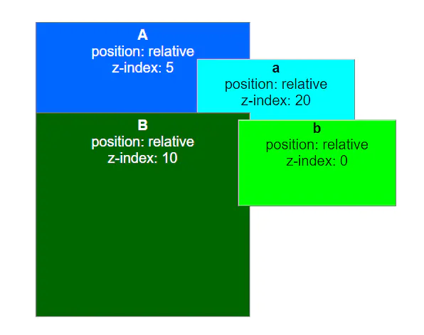

[toc]

## CSS3 新特性

[参考链接](https://www.cnblogs.com/xkweb/p/5862612.html)

1.  伪类和伪元素选择器：
    :first-child, :last-child, :nth-child(1), :link, :visited, :hover, :active
    ::before, ::after, :first-letter, :first-line, ::selection
2.  背景、边框和颜色透明度：
    background-size, background-origin, border-radius
    box-shadow, border-image
    rgba
3.  文字效果：text-shadow, word-wrap
4.  2D 转换和 3D 转换：
    transform, translate(), rotate(), scale(), skew(), matrix()
    rotateX(), rotateY(), perspective
5.  动画、过渡：animation, transition
6.  多列：column-count, column-gap, column-rule
7.  用户界面：resize, box-sizing, outline-offset

## link 和 @import 的区别

1. link 是 HTML 标签，不仅可以加载 CSS 文件，还可以定义 RSS、rel 连接属性等；@import 是 CSS 提供的语法，只有导入样式表的作用。
2. 加载页面时，link 标签引入的 CSS 被同时加载；@import 引入的 CSS 将在页面加载完毕后被加载。
3. @import 是 CSS2.1 才有的语法，故只可在 IE5+ 才能识别；link 标签作为 HTML 元素，不存在兼容性问题。
4. 可以通过 JS 操作 DOM ，插入 link 标签来改变样式；由于 DOM 方法是基于文档的，无法使用@import 的方式插入样式。
5. link 引入的样式权重大于@import 引入的样式。

## CSS 选择器的解析规则

从右向左，这样会提高查找选择器所对应的元素的效率

## CSS 选择器优先级

选择器按优先级先后排列：!important>内联>id>class = 属性 = 伪类 >标签 = 伪元素 > 通配符 \*

- important 声明 1,0,0,0
- ID 选择器 0,1,0,0
- 类选择器 0,0,1,0
- 伪类选择器 0,0,1,0
- 属性选择器 0,0,1,0
- 标签选择器 0,0,0,1
- 伪元素选择器 0,0,0,1
- 通配符选择器 0,0,0,0

## CSS 清除浮动的方式

1.  额外标签法
    > 在需要清除浮动的元素后面添加一个空白标签，设置类名 clear，设置`clear: both;`即可
2.  父级元素添加`overflow: hidden;`
3.  伪元素清除浮动
    >     对需要清除浮动的元素添加一个clearfix类名，设置

```css
.clearfix:after {
  /*正常浏览器 清除浮动*/
  content: '';
  display: block;
  height: 0;
  clear: both;
  visibility: hidden;
}
.clearfix {
  *zoom: 1;
  /*zoom 1 就是ie6 清除浮动方式  * ie7以下的版本才能识别 其他浏览器都不执行(略过)*/
}
```

## CSS 垂直居中

1. 定位 + 负边距
2. display: flex 弹性布局

```css
.outer {
  display: flex;
  align-items: center;
  justify-content: center;
}
.inner {
  width: 400px;
  height: 400px;
  background-color: red;
}
```

```html
<div class="outer">
  <div class="inner"></div>
</div>
```

3. display: table
4. 绝对居中

```css
div {
  width: 300px;
  height: 300px;
  background-color: red;
  position: absolute;
  left: 0;
  right: 0;
  top: 0;
  bottom: 0;
  margin: auto;
}
```

## flex 的属性有哪些

```
flex布局是CSS3新增的一种布局方式，我们可以通过将一个元素的display属性值设置为flex从而使它成为一个flex容器，它的所有子元素都会成为它的项目。

一个容器默认有两条轴，一个是水平的主轴，一个是与主轴垂直的交叉轴。我们可以使用flex-direction来指定主轴的方向。我们可以使用justify-content来指定元素在主轴上的排列方式，使用align-items来指定元素在交叉轴上的排列方式。还可以使用flex-wrap来规定当一行排列不下时的换行方式。

对于容器中的项目，我们可以使用order属性来指定项目的排列顺序，还可以使用flex-grow来指定当排列空间有剩余的时候，项目的放大比例。还可以使用flex-shrink来指定当排列空间不足时，项目的缩小比例。
```

> 以下 6 个属性设置在容器上。

- flex-direction 属性决定主轴的方向（即项目的排列方向）。
- flex-wrap 属性定义，如果一条轴线排不下，如何换行。
- flex-flow 属性是 flex-direction 属性和 flex-wrap 属性的简写形式，默认值为 rownowrap。
- justify-content 属性定义了项目在主轴上的对齐方式。
- align-items 属性定义项目在交叉轴上如何对齐。
- align-content 属性定义了多根轴线的对齐方式。如果项目只有一根轴线，该属性不起作用。

> 以下 6 个属性设置在项目上：

- order 属性定义项目的排列顺序。数值越小，排列越靠前，默认为 0。
- flex-grow 属性定义项目的放大比例，默认为 0，即如果存在剩余空间，也不放大。
- flex-shrink 属性定义了项目的缩小比例，默认为 1，即如果空间不足，该项目将缩小。
- flex-basis 属性定义了在分配多余空间之前，项目占据的主轴空间。浏览器根据这个属性，计算主轴是否有多余空间。它的默认值为 auto，即项目的本来大小。
- flex 属性是 flex-grow，flex-shrink 和 flex-basis 的简写，默认值为 01auto。
- align-self 属性允许单个项目有与其他项目不一样的对齐方式，可覆盖 align-items 属性。默认值为 auto，表示继承父元素的 align-items 属性，如果没有父元素，则等同于 stretch。

## z-index 是干什么用的？默认值是什么？与 z-index: 0 的区别？
参考链接：[搞懂Z-index的所有细节](https://www.jianshu.com/p/cdd90d28380b)
> z-index 属性设置元素的堆叠顺序，且只在属性position: relative/absolute/fixed 的时候才生效。

> `z-index: auto` 是默认值，与`z-index: 0`是有区别的：
> `z-index: 0` 会创建一个新的堆叠上下文，而 `z-index: auto` 不会创建新的堆叠上下文

举例：考虑如下这种情况
```html
<div class="A">
  <div class="a"></div>
</div>
<div class="B">
  <div class="b"></div>
</div>
```

> 上图中div的`z-index`均为整数的时候div(a)的`z-index`虽然比div(B)大，但是div(A)和div(a)是在一个堆叠上下文，而div(B)和div(b)是在一个堆叠上下文，这两个堆叠上下文是通过父级也就是div(A)和div(B)的`z-index`来决定层叠顺序的。

---

> 上图将div(A)的z-index设置为auto，这时候因为`z-index: auto` 不会创建新的堆叠上下文，因而div(a)的`z-index`比div(B)大，所以div(a)会在div(B)的上面

总结：
1. 当Z-index的值设置为auto时,不建立新的堆叠上下文,当前堆叠上下文中生成的div的堆叠级别与其父项的框相同。
2. 当Z-index的值设置为一个整数时,该整数是当前堆叠上下文中生成的div的堆栈级别。该框还建立了其堆栈级别的本地堆叠上下文。这意味着后代的z-index不与此元素之外的元素的z-index进行比较。

##  vw 和 vh 的概念
vw（Viewport Width）、vh(Viewport Height)是基于视图窗口的单位，是css3的一部分，基于视图窗口的单位，除了vw、vh还有vmin、vmax。

- vw:1vw 等于视口宽度的1%
- vh:1vh 等于视口高度的1%
- vmin: 选取 vw 和 vh 中最小的那个,即在手机竖屏时，1vmin=1vw
- vmax:选取 vw 和 vh 中最大的那个 ,即在手机竖屏时，1vmax=1vh


